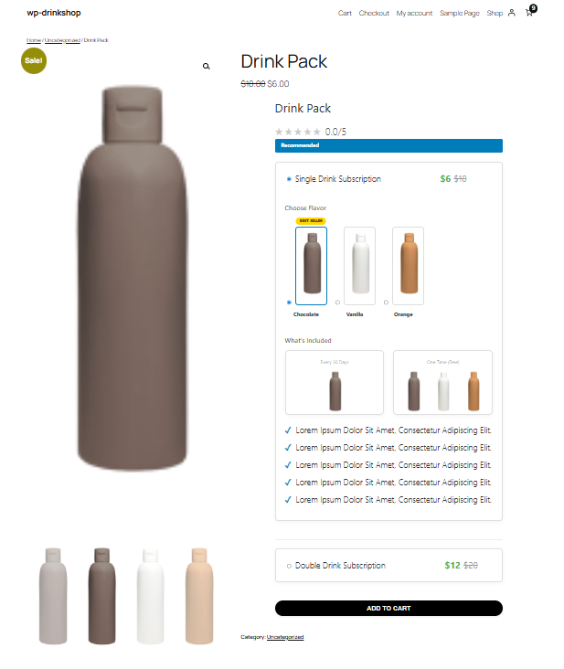
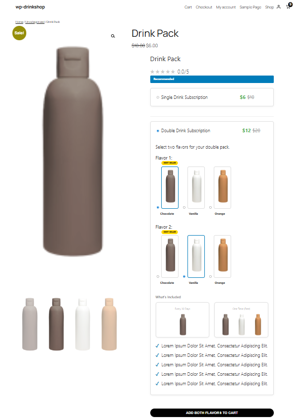
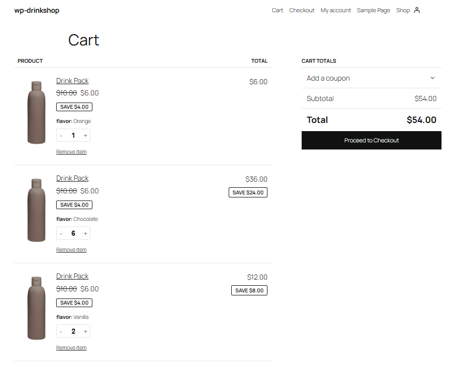

# WooCommerce Custom Drink Subscription UI



_Custom drink subscription interface with single and double flavor options_


\_Cart items

## Table of Contents

- [Features](#features)
- [Requirements](#requirements)
- [Installation](#installation)
- [How It Works](#how-it-works)
- [Customization](#customization)
- [Troubleshooting](#troubleshooting)
- [Screenshots](#screenshots)

## Features

### Dual Subscription Options

- **Single Flavor Subscription** (Recommended)
  - Visual flavor selection
  - Delivery frequency options
  - Benefits checklist
- **Double Flavor Subscription**
  - Simple one-click add to cart
  - Discounted pricing display


## Requirements

| Component   | Version |
| ----------- | ------- |
| WordPress   | 5.0+    |
| WooCommerce | 4.0+    |
| PHP         | 7.4+    |
| jQuery      | 3.0+    |

## Installation

1. **Add template file**:
   ```bash
   wp-content/
   └── your-theme/
       └── woocommerce/
           └── single-product/
               └── add-to-cart/
                   └── variable.php
   Add custom CSS to your theme's style.css or customizer.
   ```

Verify product setup:

Ensure product is variable type

Create all flavor variations

Set product gallery images
